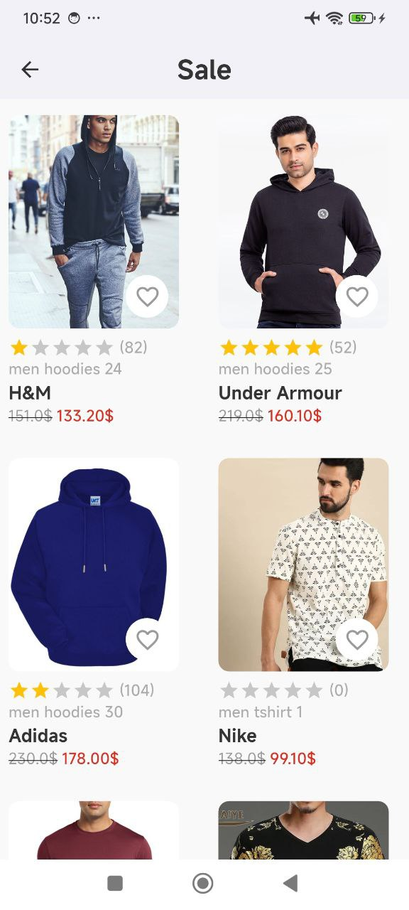

# 🛒 Shopping App

A full-stack E-commerce application built with **Flutter**, **Node.js**, and **MongoDB**, featuring a smooth user experience, secure authentication, and a dynamic product catalog with cart functionality.

---

## 🚀 Features

- 🔐 Secure login & signup
- 📦 Product catalog with detailed views
- 🛒 Add-to-cart and cart management
- 🔄 Cart syncing (local and server)
- 🌐 Backend integration via REST API
- 📡 Works offline using Hive for local storage

---

## 🧱 Tech Stack

### Frontend (Flutter)
- **State Management**: Provider
- **Architecture**: Clean Architecture
- **Networking**: Dio (for REST API)
- **Local Storage**: Hive (for local cart data)

### Backend
- **Server**: Node.js with Express
- **Database**: MongoDB (NoSQL)
- **APIs**: RESTful endpoints for product, auth, and cart logic

---

## 🔗 Backend Repository

👉 [Shopping App Backend (Node.js + Express + MongoDB)](https://github.com/muhammednashat/server_shopping_app)

> Be sure to clone and set up the backend before running the Flutter app.

---

## 🔌 API Integration

- All data is fetched and submitted via **REST API** using Dio.
- Authentication includes secure login with hashed passwords.
- Error handling and loading states implemented.

---

## 🛠️ Getting Started

### Prerequisites
- Flutter SDK
- Node.js + MongoDB installed locally or configured remotely

### Backend Setup
- git clone https://github.com/your-username/shopping-app-backend
- cd shopping-app-backend
- npm install
- npm start

##Flutter App Setup
- flutter pub get
- flutter run

📸 Screenshots
  

 
 
 
 
 
 
 
 
 
 
 
 
 
 

 
  
